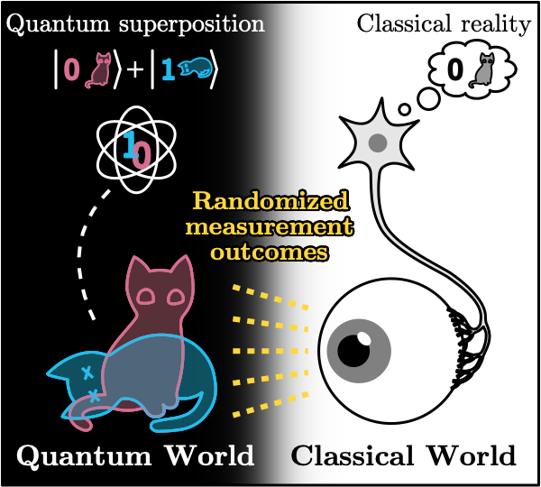
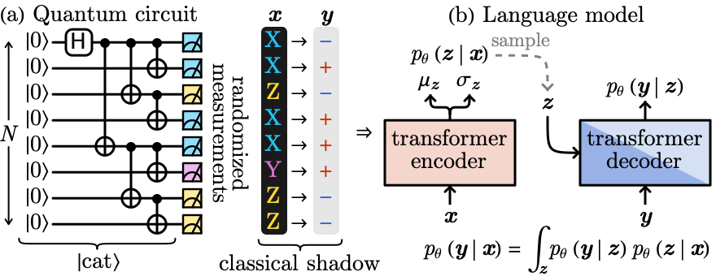
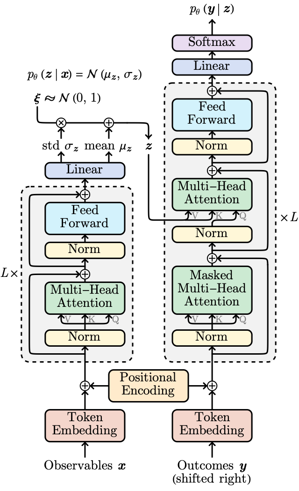

# Emergent Classicality from Information Bottleneck

This GitHub repository hosts the source code and data associated with the research work [arXiv: 2306.14838](https://arxiv.org/abs/2306.14838). The work was presented on the conference Machine Learning for Quantum Many-Body Systems (June 2023) at Perimeter Institute ([video recording](https://pirsa.org/23060044)).

## Overview

The objective of this research is to investigate to what extent a classical intelligent agent can decipher the quantum nature of a many-body quantum system from its surrounding environmental noises. The research is motivated by an enduring conundrum in physics -- the quantum-to-classical transition. Our research leveraged the power of artificial intelligence to provide a fresh perspective on this age-old question. We invite an artificial intelligence agent to observe one of the most paradoxical phenomena in quantum mechanics - Schrödinger’s Cat and study the intelligence agent's understanding of the classical or quantum reality of the cat.

## Model Setup

Schrödinger’s cat, a thought experiment proposed by physicist Erwin Schrödinger, is a puzzling quantum superposition of states where a cat can be simultaneously dead and alive until observed. In fact, the cat state of a few qubits can be repeatedly prepared on quantum devices available nowadays. However, in our daily experiences, we never encounter such bizarre superpositions. Objects are either here or there, but never both. This raises the pressing question - how does the quantum world transition into the classical world we experience every day? This is what we refer to as the quantum-to-classical transition, and it's a mystery that scientists have been grappling with for decades.

To tackle this problem, we sought the assistance of a powerful ally - Artificial Intelligence. We harnessed the power of generative language models, a type of artificial intelligence that's been used to write human-like text, to model the 'classical shadows' of quantum states. These shadows, obtained from randomized local measurements on quantum many-body states, are the classical records of quantum states that disperse in the environment as random noise after the decoherence of the quantum system. However, by collecting these classical shadows of Schrödinger’s cat and processing them with a classical machine learning algorithm, we hope to decode the quantum nature of the cat.

## Transformer Architecture

We used a transformer-based language model to simulate the 'classical shadows' of quantum states. For this reason, we call our model **Classical Shadow Transformer (CST)** (source code: [CST.py](CST.py)). The transformer model is an architecture primarily used in the field of deep learning for handling sequential data. It's known for its scalability and ability to manage long-term dependencies, making it ideal for modeling intricate correlations in classical shadow data for our project. The transformer model processes these classical shadows of Schrödinger’s cat on a classical computer, aiming to decode the cat's quantum nature. We evaluate the model's ability to 'understand' and reproduce the quantum coherence encoded in the classical shadow data.

The architecture consists of an encoder that processes the input (sequence of local observables) and a decoder that produces the output (sequence of measurement outcomes). Each consists of self-attention layers, which allow the model to focus on different parts of the input sequence when producing an output. A key variation is that we borrow the idea from $\beta$-VAE to introduce a sampling layer in the latent space, which enables us to control the information bottleneck of the transformer model.

We investigate classical shadow transformers with different information bottlenecks and leaning from classical shadows of different system sizes. We trained our model and collect data in [data_collect.ipynb](data_collect.ipynb) and analyze the data in [data_analyze.nb](data_analyze.nb). Our trained models are hosted in the [model](model) folder and the generated data files are hosted in the [data](data) folder.

## License

This project is licensed under the MIT License - see the [LICENSE](LICENSE) file for details.
